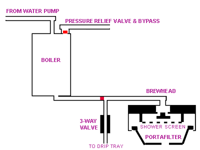
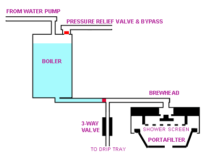
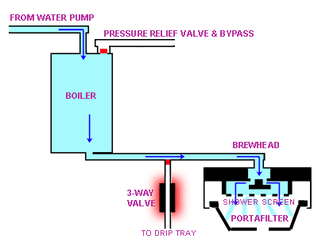
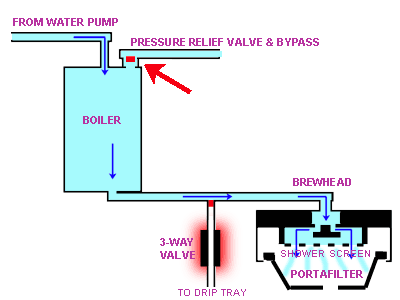
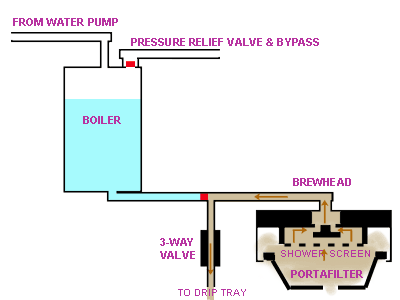
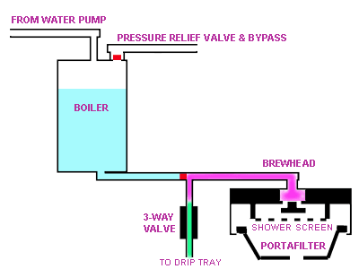
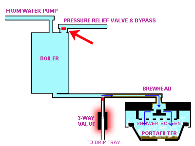
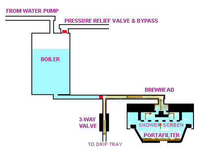
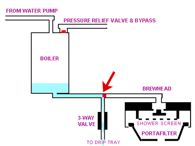

# Rancilio Silvia 3-way-valve explanation

[Back to index](../readme.md)

> Original from [Espresso! My Espresso!](www.EspressoMyEspresso.com)
>
> Now archived here: https://web.archive.org/web/20211212032422/http://www.espressomyespresso.com/3way/1.html
> 
> Screenshots of the original site can be found in the [screenshots folder](./screenshots).

## The Basic Layout Of an Espresso machine with a 3-Way Valve

Here we see a diagrammatic layout of an espresso machine that is equipped with a 3-way valve.
The 3-Way valve controls the flow of water from the boiler to the brewhead, and from the brewhead into the drip tray.

It is called "3-way" because there are three water paths connected to the valve:

- Boiler to 3-Way
- Brewhead to 3-way
- 3-Way to drip tray

In this image the machine is "at rest." The red square between the boiler and the 3-way valve represents the gate controlled by the 3-way valve. The valve works by applying an electromagnetic field to a metal plunger inside the valve. When power is applied it pulls the valve open. When no power is applied (the valve is "at rest") the plunger blocks the passage as shown above.
As shown here, the brew switch is in the off position and the 3-way is not energized. It blocks the flow of water, essentially keeping the boiler closed at its exit. Click "NEXT" or "BACK" at the bottom of each page to move through the presentation

**1** - Note that all these illustrations are designed to show how an espresso machine operates and are not an actual representation of how the parts actually interface or to indicate their actual position in the machine.

**2** - **WARNING** - There are some machines that, for some reason, are designed with the 3-way valve between the pump and the boiler— not in the brewhead as shown above (one example may be some home machines manufactured by Gaggia). If you suspect that you machine is so designed, refer to your owner's manual before attempting to backflush.

## The Boiler is Full

When the boiler is first filled (when the machine is new), and from that time onward, the 3-Way valve now has something to do. It's job is to close off the exit of the boiler so that the water being heated cannot escape. This is the "at rest" state in that the machine looks like this whether it is off or if the power switch (only the power switch) is in the on position. Note that the brewhead is open to the atmosphere through the 3-way and into the drip tray area at this time.

## Brewing Espresso

When brewing espresso (the brew switch is in the "ON" position), two things happen concurrently:

- The 3-way valve is actuated and opens the path from the boiler to the brewhead. it also closes off the path into the drip tray so the entire flow goes through the coffee.
- The pump is activated and begins pumping water into the boiler. Water, under pressure from the action of the pump, is now being pushed through the brewhead and through the portafilter.

## Overpressure

The brewing process continues, but the flow of water is now being resisted. The flow is stopped, partially or completely, by a very fine grind. The excess water had forced the over-pressure relief valve to open (indicated by the red arrow) and some water now flows back into the water tank.

This is a normal occurrence and happens a lot more often than you might think. In some machines, if there is a separate hose for this (such as the short hose in Silvia's water reservoir) you can watch the water returning to the tank.

The rate of flow is regulated by the pressure of the spring against the over-pressure valve, and can vary from barely a dribble to a rapid flow.

## End of Brew Cycle

The instant the brew switch is turned off, the 3-way valve returns to its at-rest position. The pump is now off, and path from the boiler to the brewhead is now is closed.

There is some residual pressure remaining between the 3-way valve and the brewhead, all the way to the top of the puck. The path through the 3-way valve to the drip tray is now open, and since the pressure in the brewing path is greater than that in the atmosphere, the pressure forces the water into the drip tray.

Along with some of the hot water that has yet to enter the brewhead, some "dirty" water, tainted with coffee particles and oils reverses it normal direction of travel and ends up in the drip tray as well. This is important to note because this invariably ends up leaving just a bit of this residual coffee "debris" along that path.

## Where the Dirt Hides

The PURPLE and GREEN areas indicate portions of the brewing path that are now tainted with coffee which will soon be conducting fresh water for the next brewing cycle. The green area is the body of the 3-way valve. 

This can be disassembled and cleaned. The purple area represents a portion of the machine inside the brewhead that is difficult or impossible to access. The brewhead behind the shower screen area can be accessed on most machines so it is not indicated here, but it also receives a good coating of coffee debris.

## Backflushing - Part 1

There has to be some way to get all that coffee debris and residue out of the brewing path, and back flushing is the way. Just as the we saw how the 3-way valve allows the dirty water back through the brewing path, we can use that to our advantage to force a cleaning product back through there to clean out the dirt.

To backflush you need two additional things- a blind filter and the proper cleaning product. The blind filter can be something as simple as a rubber disk that fits the bottom of a standard portafilter or it can be a portafilter basket without any holes in it ("blind"). 

The cleaning product should be an espresso machine cleaner." I recommend Urnex Cafiza. It works great and is so effective that you can use less of it than with some competing products. It is important to note that this cleaner should NEVER be placed in the water reservoir. It is not made to go through the boiler. As always, read all instructions for your espresso machine as well as the cleaner before use. For example, some machines contain aluminum parts and some cleaners can be very rough on aluminum.

The specific steps to backflushing can be found on my How To Backflush page. Basically, place some of the cleaner in the blind filter, lock the portafilter in place, then turn on the brew switch. The water pressure increases, and when you hear the pump labor for a moment turn off the switch.

As you see here, the water is mixing with the cleaner and the over-pressure relief valve has opened (indicated by the red arrow) signifying that the brew switch is ready to be turned off because that is as much pressure as the machine can develop.

## Backflushing - Part 2

The brew switch has just been turned off. The water that was under pressure in the brewing path has mixed with the cleaner, and now it is released back through the brewing path, through the 3-way valve, and into the drip tray. The sudsy cleaning solution soaks the parts of the brewing path that you cannot reach. You know it is in there because you can see the suds in the drip tray when the excess cleaner is expelled. Leave that soak for a few minutes, then repeat the on and off cycle with the brew switch again. At first the cleaner will come out tinted with coffee as shown here. Continue this until only clean solution comes out, untainted from coffee indicating that you have completed the cleaning job. At that point you should remove the portafilter, remove any remaining cleaning solution, and replace the portafilter. Repeat the the backflushing process until clean water comes through the 3-way valve into the drip tray with no trace of cleaning solution.

## Whoops

**This is what can happen if you don't backflush ocassionally**

As indicated by the arrow, the 3-way valve is now stuck open because of a build up of coffee particles, oils, and other buildup. The valve can no longer seat properly and is leaking. Water can bypass the valve and go into the drip tray either through the 3-way or through the brewhead. In either case, the water level in the boiler is now low and will soon trip the overheat protection device. In some machines this can be reset but in others it can damage a part that needs to be replaced. This overheating can damage the boiler seals or other related parts.