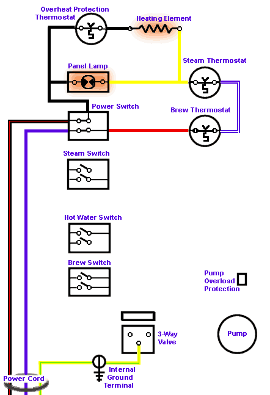

# Rancilio Silvia Wiring Diagram

[Back to index](../readme.md)

> Original from [Espresso! My Espresso!](www.EspressoMyEspresso.com)
>
> Now archived here: https://web.archive.org/web/20220113145130/http://www.espressomyespresso.com/Silvia/SilviaWiring.html
> 
> Screenshots of the original site can be found in the [screenshots folder](./screenshots).

## How a Rancilio Silvia Works

**Index:**

0. [All Wires](#all-wires)
2. [Off](#off)
3. [On, Heating Up](#on-heating-up)
4. [On, At Temperature](#on-at-temperature)
5. [Brewing Espresso](#brewing-espresso)
6. [Steam, Heating Up](#steam-heating-up)
7. [Steam, At Temperature](#steam-at-temperature)
8. [Pumping Hot Water](#pumping-hot-water)
9. [Overheated](#overheated)
10. [Modification for PID](#modification-for-pid)
11. [Dual Setpoint PID](#dual-setpoint-pid)
12. [Advanced Dual Setpoint PID](#advanced-dual-setpoint-pid)

### All Wires

Here is the entire wiring diagram of the Rancilio Silvia. This shows all electrical wiring and components.

### Off

**Silvia is Off**

As you can see here, the power switch is in the "Off" position. No power can get into the machine past the power switch. Of interest is the fact that both the common and the hot leads are controlled by the switch for added safety. Note that even though both leads are switched, the leads at the power switch itself as still "hot" and present danger if the cover is removed. Always unplug the machine before accessing internal components!

### On, Heating Up

**Power on, Boiler is Heating up to Brew Temperature**

The power switch is in the on. You can see that the contacts in the power switch are closed and electricity flows through the switch, first through the brew thermostat and then through the steam thermostat to get to the heating element. Even though you are not using the steam function at this time, electricity still flows through both thermostats.

### On, At Temperature

**Brewing Temperature has been Achieved**

Silvia is at the brew temperature. The brew thermostat's internal thermal spring has been tirggered and the contacts in the brew thermostat are now open ("off"). At this time the only thing being powered is the indicator lamp in the power switch itself. No electricity can get to the heating element, and the panel indicator lamp is off. When the temperature drops the brew thermostat will cloce (to the "on" position) and the heating element will once again be powered. This cycle repeats over and over.

### Brewing Espresso

**Brewing Espresso**

With the brew switch in the "on" position, the pump as well as the 3-way valve are activated. The water can now flow past the 3-way valve to the brewhead. Water is pumped through the brewhead. Note that the circuit that powers the pump and 3-way valve is independent from the heating circuit. The heating element is still free to turn on or off as controlled by the brew thermostat while the brewing process proceeds. For more details on how the 3-way valve works, see my article [3-Way Valve Hows and Whys](../3_Way_Valve/index.md).

### Steam, Heating Up

**Heating up to Steaming Temperature**

With the steam switch on, electricity flows through the steam thermostat and then through the heating element, and the panel lamp is illuminated to show that the heating element is on. Note that the blue wire from the steam switch bypasses the brew thermostat and that even though the brew thermostat is open ("off") at this time, electricity can still get to the steam thermostat which is now in control of the heating element.

### Steam, At Temperature

**At Steaming Temperature**

Once the steam temperature is reached, the steam thermostat opens and stops the flow of electricity through the heating element. Note that at this point the only thing powered is the lamp in the steam switch and the lamp in the power switch.

### Pumping Hot Water

**Hot Water Switch is On**

With the hot water switch turned to the on position, the pump is activated but the 3-way valve is still at rest. The pump pressurizes the boiler, and when the steam knob is opened, hot water will be pumped through the steam wand as this is the only vent from the boiler that would "normally" be opened at this time. The exception is when the hot water knob is left closed and pressure builds up too high in the boiler. The bypass valve will open and water will be pumped back to the boiler. Note that the heating circuit is independent of the pump circuit and the heating element is free to turn on and off during this process.

### Overheated

**Overheated- Safety Thermostat Tripped**

For some reason, Silvia has overheated. The third thermostat which has as its only purpose to protect the machine from overheating has been triggered and is now open ("off"). Even though the panel lamp will be illuminated, electricity cannot flow to the heating element. This is usually caused by a low water level in the boiler- possibly from a leak that allows water to escape the boiler when the steam switch is on or by leaving the machine in the steam setting and using lots of steam without refilling the boiler. It can also be caused by a steam thermostat that fails in the closed position. To reset the machine, wait for it to cool off, then unplug the machine from power, remove the top, and press the little red button on the thermostat on the front face of the boiler.

### Modification for PID

**Complete Wiring Schematic with PID**
In this example I have included all the various wires that would or could be added or modified for a full PID install. The numbers below refer to those in the diagram:

#### 1
The power wires for the PID can be piggy-backed to the existing wiring in the machine. On Silvia this can be done by using piggyback spade adaptors right on the back of the power switch. In this way turning on the espresso machine also powers the PID at the same time. Alternatively, a separate power cord can be attached to the PID and a separate switch wired.

#### 2
The only wires in the machine that are removed or modified are those connected to the original brew thermostat. These are wired to the output side of the Solid State Relay (SSR). Simply removing the wires from the thermostat and using double-male spade connectors works so that the existing wires do not need to be cut. This is done because the entire PID setup is designed to replace the brew thermostat. Be sure that the connectors used are firmly connected and insulated!

The SSR should be firmly mounted to a metal surface with a some heat transfer paste used. I placed mine under the water tank against the metal base where I found there was a lot of space. Some have mounted theirs behind the face plate, to the right of the 3-way valve. The connections must be protected as the output side carries high current!

Be aware that the input side of the SSR (the wires that come from the PID and connect to the SSR) are DC, so polarity counts- that is, there is a "+" and a "-" on that side. Polarity does not matter on the other side- the pair of wires that come from the machine.

#### 3
The washer-style thermocouple is attached to the top of the boiler using an existing screw which previously held down the brew thermostat. This is where the PID gets the temperature information it needs to operate. Some heat-transfer grease should be used between the thermocouple and the boiler. Be sure to buy a thermocouple with wires that are long enough for your installation.. The two wires can be equally shortened, but they should not be lengthened.

#### 4
Finally, for safety I ran the ground wire for the PID to the existing ground lug on Silvia's boiler. If you mount the PID in a metal box and the PID does not have a ground connection, connect this ground wire to the mounting box for safety's sake. For PIDs without a ground connection which are mounted in a plastic box this will probably not be used.

### Dual Setpoint PID

**Dual Setpoint PID Wiring Schematic**
In this example we have modified the basic PID installation (seen on the previous page) with an added, advanced function. In some PIDs there is the option for dual setpoints. That means that the PID is capable of having two temperature setting programmed. The PID has two additional contacts on it that when shorted out (connected together) they select the second setpoint. When the two contacts are disconnected the first (default) setpoint is selected. This is usually used to control steam temperature.

To trigger this function merely connect a switch across the contacts. This can be an added switch on the PID's mounting box or it can be the steam switch in the espresso machine as shown here.

The wires (5) go directly from the steam switch's terminals to the external PID where they would connect to the two second setpoint terminals. Important to note here is that the original wires from the steam switch have been removed and are no longer used. These should be carefully insulated so as not to cause a short. Also note that the wires have been removed from the steam thermostat and have been connected together so that the steam thermostat is no longer in the circuit. If left connected, the machine could only achieve the set temperature of the steam thermostat and no more than that, regardless what the temperature the PID was set.
This is the easy and simple way to make this change, but the problem is that the illumination lamp in the steam switch will not function because there is no longer any AC power going to the switch.

### Advanced Dual Setpoint PID

**Advanced Dual Setpoint PID Wiring Schematic**

In this example we have further modified the second setpoint wiring. All changes in this modification are made in order to get the illuminating lamp in the steam switch to function when the switch is used to select the second setpoint. All the variations from the previous page are to achieve that function.

The original lead (in red) at the back of the steam switch remains connected as well as the black lead on the other end. I have added a jumper from the black lead and it goes to the windings of a relay (6). The green lead from the steam switch also goes to the relay's windings.The black lead at number "7" uses the terminal on the steam switch that was vacant up until now. Normally, that side of the switch just turned on the internal indicator lamp, but it now also controls the other wire that powers the relay so that both the neutral and hot sides are switched for added safety.
When you turn the steam switch on now it will control two things- it illuminates the lamp in the switch and it energizes the electromagnetic windings in the relay.
At the other end of the relay we see the same two wire that went from the PID's second setpoint selection terminals to the steam switch. These same two wires now connect to a pair of normally open ("N.O.") switch contacts on the relay.
When the relay is energized, the electromagnet is energized, the contacts we are using in the relay are closed, and the second setpoint is selected.

Be aware that the relay MUST have windings rated at 120 volts AC or it will either not operate or burn out. The ratings of the contacts, given separately n the specifications for relays, must match the PID's requirements fro such function, but since most PIDs send nominal current for this function, all you need to worry about is the rating for the windings I first mentioned.